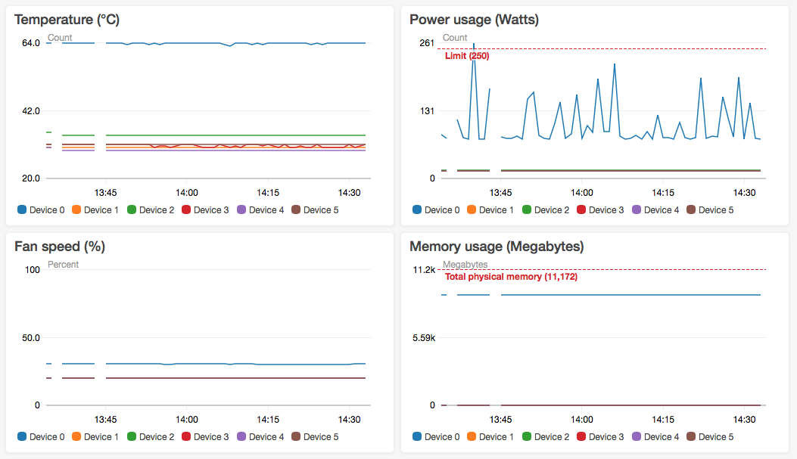

# nvcw

This simple python module and command line tool allows you to remote monitor your nvidia GPU device with [AWS CloudWatch](https://aws.amazon.com/cloudwatch/). The following GPU state variables are queried and sent periodically to CloudWatch:
 - power usage in Watts
 - power usage percents relative to usage limit
 - memory usage in megabytes
 - memory usage in percents relative to the total physical memory
 - cooling fan speed in percents
 - temperature of the GPU die in degree Celsius.

## Getting Started

### Prerequisites

#### Python 3

This tool was developed and tested with Python 3.6 but you should be able to port it to Python 2.x with some limited efforts.

#### NVIDIA Management Library (NVML)
`nvcw` uses [NVIDIA Management Library](https://developer.nvidia.com/nvidia-management-library-nvml) to collect GPU device data. You have to install the python bindings of this library as described in the following links:
 - [NVML bindings for Python 3.x](https://pypi.org/project/nvidia-ml-py3/)
 - [NVML bindings for Python 2.x](https://pypi.org/project/nvidia-ml-py/)

#### AWS SDK for Python (boto3)

You will also need the [Amazon Web Services SDK for Python](http://boto3.readthedocs.io/en/latest/) called also `boto3`. You can install boto3 with pip:

```bash
pip install boto3
```

#### Configure your AWS credentials

In order to use this tool you will need an AWS account (you might be eligible for free tier). Sign up at [AWS homepage](https://aws.amazon.com) and head to [IAM Console](https://console.aws.amazon.com/iam/home) to pick up your credentials. Finish configuring your credentials on your workstation as described in the [boto3 documentation](http://boto3.readthedocs.io/en/latest/guide/quickstart.html#configuration).

### Installing

This tool is provided as-is. You can clone this repo or simple pick up and copy `nvcw.py` to your workstation.

## Usage

You can use `nvcw` as a command line tool. You can get the overview of the command line parameters by executing

```bash
python nvcw.py --help
```

from the directory where you saved or cloned `nvcw.py`. Here is the output of this command for your convenience:

```
usage: nvcw.py [-h] [-i INTERVAL] workstation

Logs some nvidia device parameters to AWS CloudWatch. Ensure you have an AWS
account configured granted to write CloudWatch logs. You can configure the AWS
account with the aws cli or with environment variables.

positional arguments:
  workstation           Name of the workstation

optional arguments:
  -h, --help            show this help message and exit
  -i INTERVAL, --interval INTERVAL
                        The logging interval in seconds. Defaults to 60.
```

After starting `nvcw` it will periodically query the GPU devices for the predefined status parameters and send these values to the AWS CloudWatch service. You can configure the query interval in seconds. You should also specify the name of your workstation that will be used as a metrics dimension in CloudWatch, so you can filter different workstation sending logs to the same AWS account. Example usage starting the periodic logging in the background with 30 seconds interval for a workstation named "rig":

```
python nvcw.py rig -i 30 &
```
You can exit from the command line tool pressing `Ctrl+C` but probably you want to keep it running in the background.

## Results

After logging for a while you can view the metrics on the [CloudWatch page](https://console.aws.amazon.com/cloudwatch) of AWS Console. Choose Metrics -> Custom Namespaces -> nvcw -> device_index, workstation to see all metrics recorded by `nvcw`. The metrics are organized two dimensions: the name of the workstation and the device index in a single workstation so you can filter the metrics for a simple GPU.

You can even create fancy CloudWatch dashboards from the metrics data like this one:



And of course you can create CloudWatch Alarms to get notified when one of the metrics surpasses a threshold. Refer to the [CloudWatch documentation](https://docs.aws.amazon.com/AmazonCloudWatch/latest/monitoring/ConsoleAlarms.html) for more info.

## Contributing

Contributions are more than welcome! Report bugs and feature requests as GitHub issues, create pull requests if you fixed a bug or have some cool new feature to share.

## Authors

Created by [Janos Tolgyesi](https://twitter.com/jtolgyesi) at [Neosperience](http://www.neosperience.com/).

## License

This project is licensed under the MIT License - see the [LICENSE.md](LICENSE) file for details
